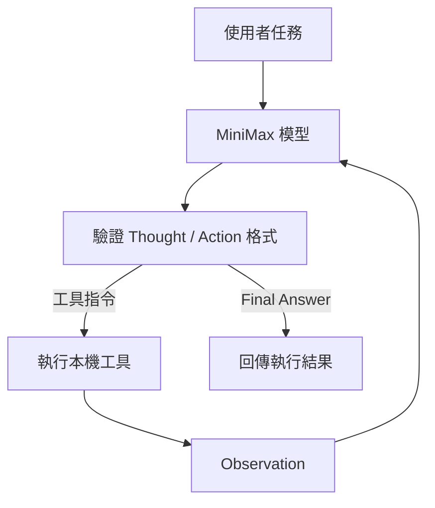

# ReAct-Agent

以 Python 和 MiniMax OpenAI 相容 API 示範 ReAct（Reasoning and Acting）循環：模型提出工具指令，Agent 執行本機工具，再將結果交回模型。

> 這是離線能力有限的教學原型。`web_search` **不連網**，只會回答列出的歷史示範查詢，不能查最新資訊。計算器只支援受限的十進位四則運算。

## 執行流程



VS Code 預覽 Mermaid 可安裝擴充套件 [Markdown Preview Mermaid Support](https://marketplace.visualstudio.com/items?itemName=bierner.markdown-mermaid)。

## 環境需求

- Python 3.10 以上；`.python-version` 指定開發版本 3.11.9。
- Windows 11 使用者可用 PowerShell 7 原生安裝與驗證；WSL 使用者可用 Bash 步驟。
- MiniMax API 金鑰，以及帳戶可使用的模型。

## Windows PowerShell 安裝

```powershell
py -3.11 -m venv .venv-win
.\.venv-win\Scripts\python.exe -m pip install -r requirements-dev.txt
Copy-Item .env.example .env
```

編輯 `.env` 後，可用 `python main.py` 執行 Agent。離線驗證不會呼叫 MiniMax API，因此不需要設定有效 API 金鑰：

```powershell
.\scripts\verify.ps1
```

驗證腳本會優先使用 `.venv-win`，也可用 `-Python` 指定 Python 執行檔。

## 安裝（WSL / Bash）

```bash
python3 -m venv .venv
source .venv/bin/activate
python -m pip install -r requirements.txt
cp .env.example .env
```

編輯 `.env`，填入三個必要設定：

```dotenv
MINIMAX_API_KEY=填入你的金鑰
MINIMAX_BASE_URL=https://api.minimax.io/v1
MINIMAX_MODEL=MiniMax-M2.5
```

`MINIMAX_MODEL` 必須為帳戶可用的模型名稱。`MINIMAX_BASE_URL` 必須是 HTTPS，不能含帳密或網址參數。環境變數會優先於 `.env`。官方端點及模型名稱參考 [MiniMax OpenAI SDK 文件](https://platform.minimax.io/docs/api-reference/text-openai-api)。

## 執行

```bash
python main.py
python main.py --task "計算 2030 減 1959" --max-steps 3
python main.py --task "分析多輪任務" --max-input-chars 12000
python main.py --task "計算 2030 減 1959" --verbose
python main.py --help
```

`--task` 預設執行程式內的歷史資料示範任務。`--max-steps` 接受 1 至 50，預設為 5。`--max-input-chars` 限制整次執行累計送往模型的序列化對話字元數，預設 60,000；這是請求大小的近似上限，不等同模型 token 數。預算耗盡會回傳 `budget_exhausted`，不再送出後續請求。每筆工具 Observation 最多 4,000 字元，超長時會標示截斷並顯示警告。預設不輸出任務全文、模型 Thought 或工具輸入；使用 `--verbose` 可顯示經終端控制字元清理的執行細節。成功時 CLI 回傳 0；設定錯誤回傳 2；拒答、截斷、格式、回應、模型 API、工具、預算或步數錯誤回傳非零狀態。

程式使用 OpenAI SDK 的 30 秒請求逾時與最多兩次重試；超過步數上限會回傳明確狀態。未預期的程式錯誤會在 `logs/crashes/` 產生去敏報告，避免保存金鑰、任務文字及 API 錯誤訊息。

## 工具範圍

`web_search` 只辨認下列示範查詢，其他查詢會明確表示沒有即時搜尋能力：

- `2024年5月20日台灣總統是誰`
- `賴清德出生日期`
- `賴清德出生年份`

`calculator` 只支援 `+`、`-`、`*`、`/`、小數、括號及一元正負號，並限制算式長度、複雜度與中間數值。

## 離線驗證

```bash
python -m pip install -r requirements-dev.txt
bash scripts/verify.sh
```

測試使用假的模型回覆與 HTTP transport，不會呼叫 MiniMax 或其他外部服務。GitHub Actions 會在 Python 3.10、3.11、3.12 執行同一套離線檢查。

<!-- [😸WSL] -->
<!-- [😸SAM] -->
